# 
Homework 14

李常颢

SA19001018

## 1 作业内容

### 1.1 Geometric Optimization

实现 Scalable Locally Injective Mappings

## 2 实现平台

### 2.1 IDE

Visual Studio 2019

### 2.2 平台工具集

Visual Studio 2017 (v141)

### 2.3 Qt 版本

5.14.1

### 2.4 OpenMesh 版本

8.0

### 2.5 编程语言

C++

### 2.6 框架

Surface Mesh Framework (Compiled with Visual Studio 2017)

## 3 界面UI

### 3.1 可视化界面

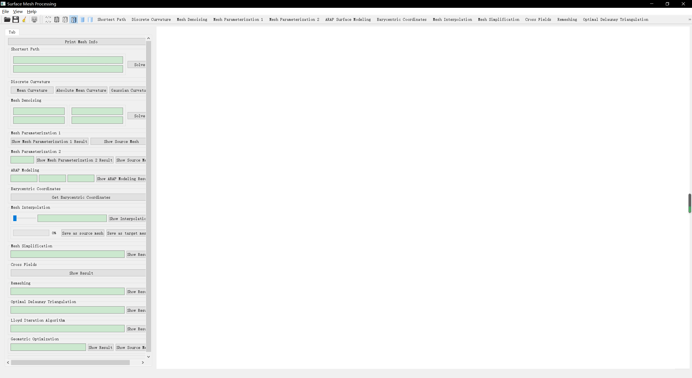

### 3.2 功能说明

#### 3.2.1 Geometric Optimization 文本框

用来设置优化的循环次数，需要为非负数才会视为有效

#### 3.2.2 Geometric Optimization 两个按钮

用来控制显示结果或原始网格

## 4 结果

### 4.1 ball

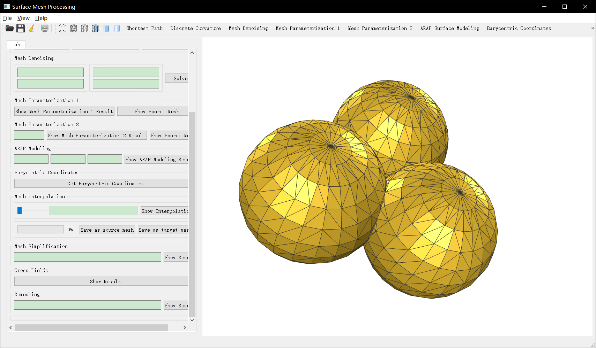

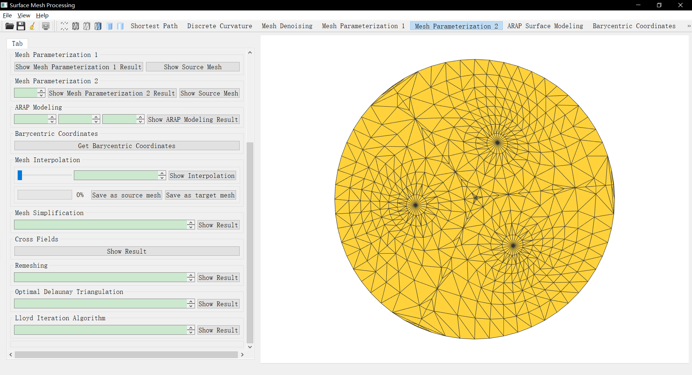

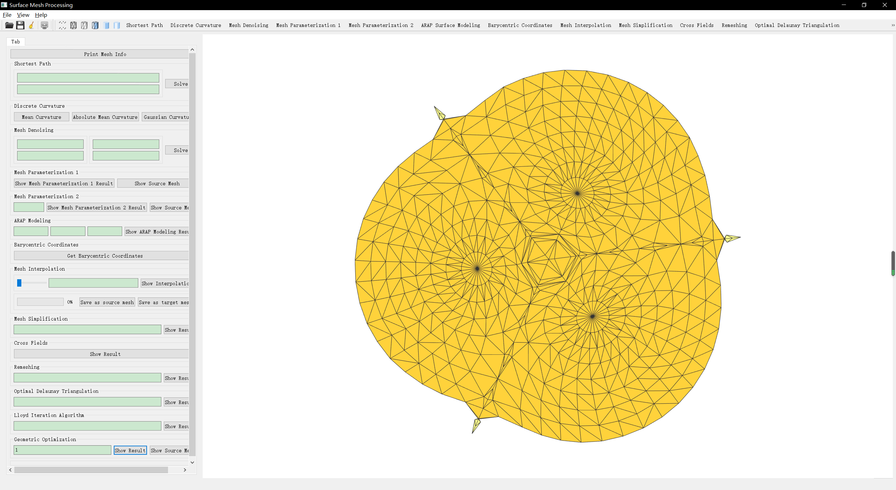

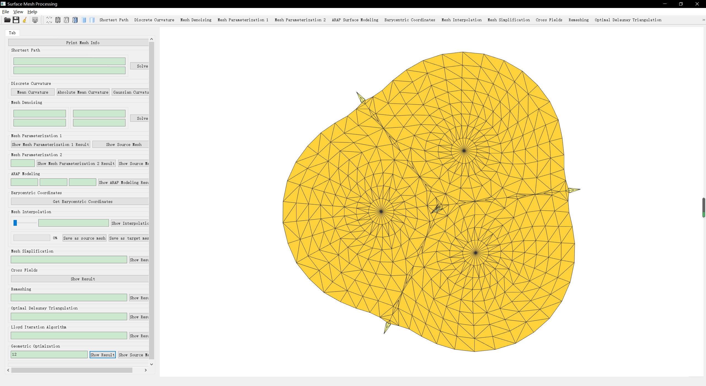

### 4.2 cat head

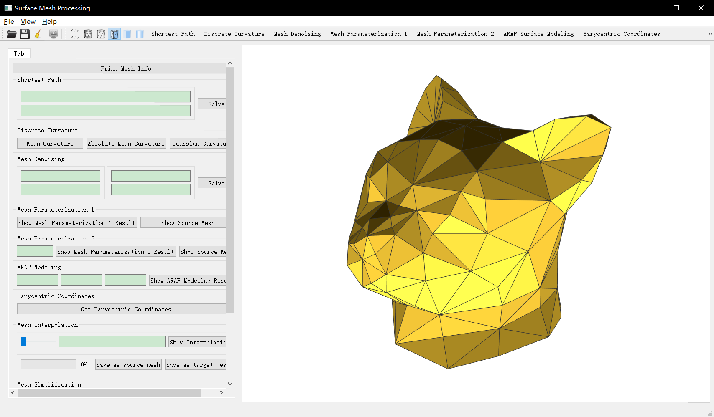

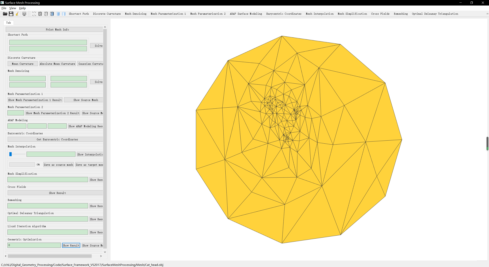

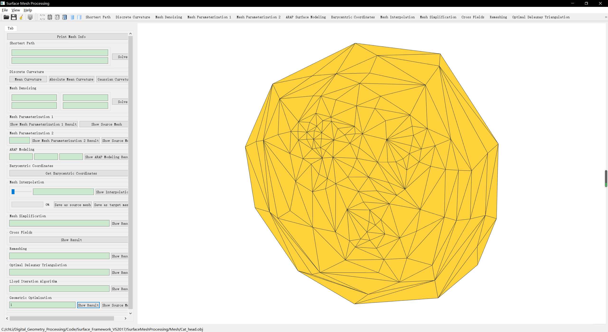

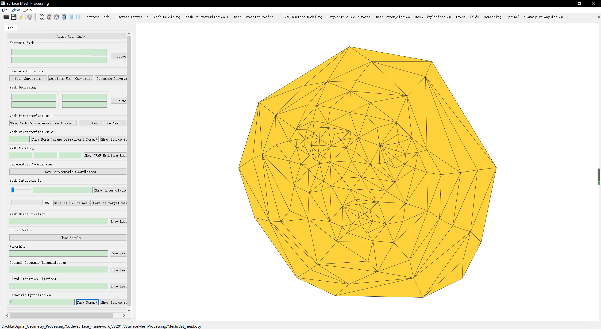

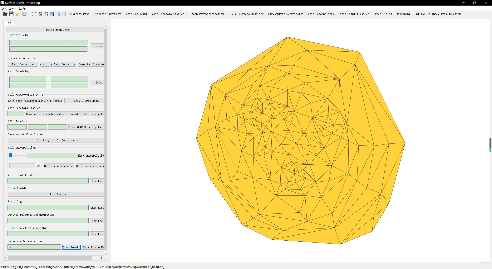

### 4.3 human face

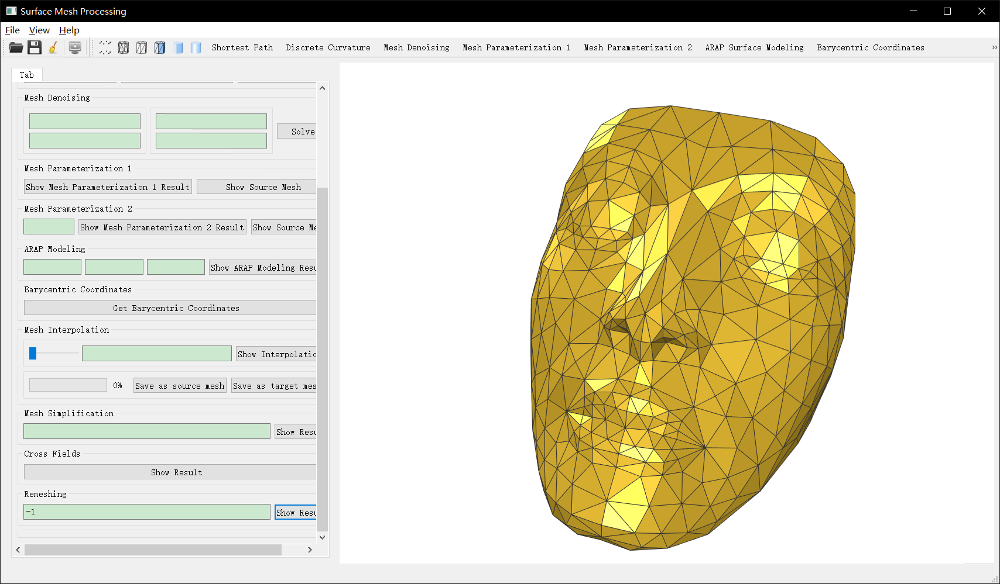

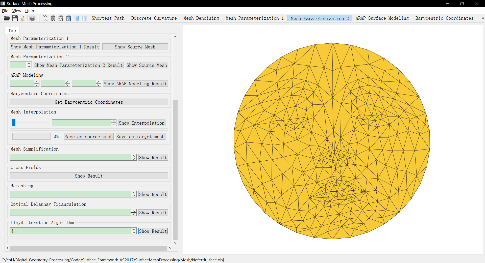

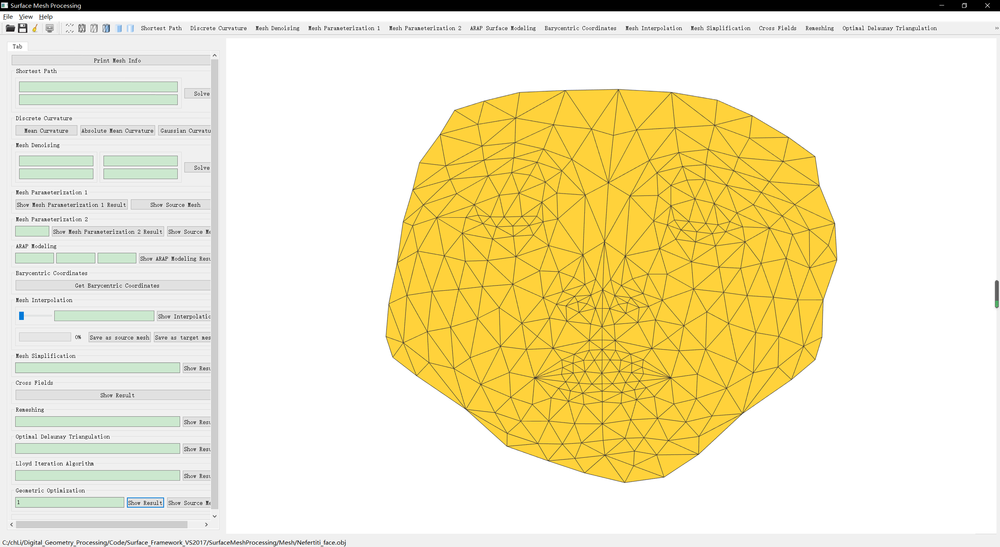

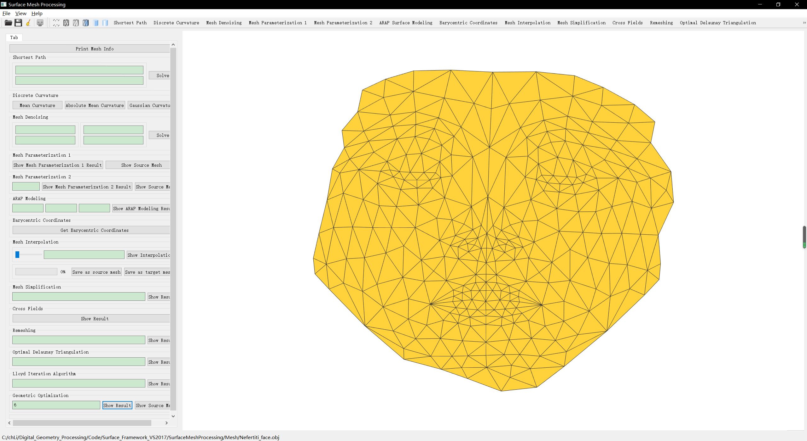

### 4.3 其他测试

用户可随意选择网格和参数，进行进一步测试。